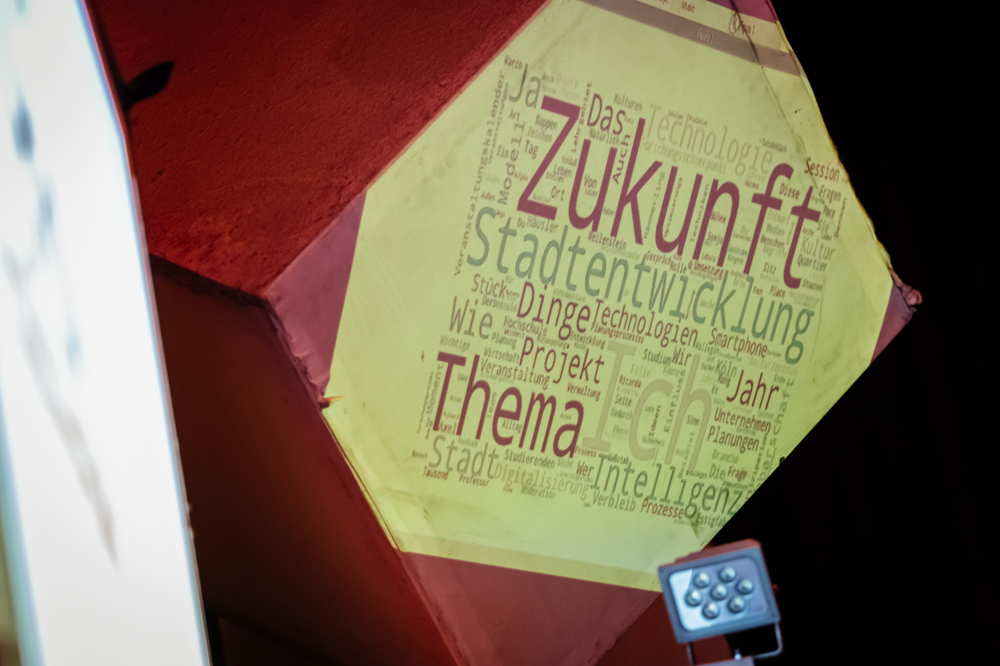

# npWordcloud

An automatic speech-to-text (STT) wordcloud generator based on [kaldi][kaldi].
----

For text to speech recognition a german language model from [University of Hamburg][model] [[2]](#2)[[3]](#3) was used.

[kaldi]: https://kaldi-asr.org/
[model]: https://www.inf.uni-hamburg.de/en/inst/ab/lt/resources/data/acoustic-models.html

## References
<!-- Kaldi -->
<a id="1">[1]</a>
Povey, D. et al. (2011).
The Kaldi Speech Recognition Toolkit.
IEEE 2011 Workshop on Automatic Speech Recognition and Understanding.

<!-- Deutsches Sprachmodel Uni Hamburg -->
<a id="2">[2]</a>
Benjamin Milde and Arne Köhn (2018).
Open Source Automatic Speech Recognition for German.
Proceedings of ITG 2018.

<a id="3">[3]</a>
Radeck-Arneth, S. et al. (2015).
Open Source German Distant Speech Recognition: Corpus and Acoustic Model.
Proceedings Text, Speech and Dialogue (TSD), Pilsen, Czech Republic, 480-488.

<a id="4">[4]</a>
Wartena, C. (2019).
A Probabilistic Morphology Model for German Lemmatization.
In: Proceedings of the 15th Conference on Natural Language Processing (KONVENS 2019): Long Papers. Pp. 40-49, Erlangen.

